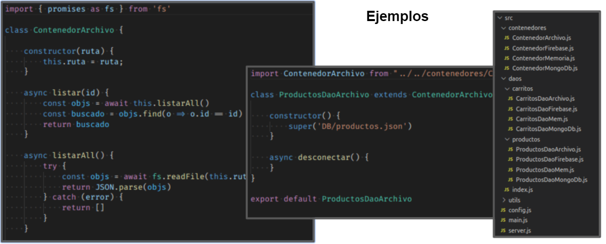

# PROGRAMACION BACKEND

# Comisión #32095

# Desafio 10 (2da Entrega del Proyecto Final)

## Consigna:

---

Basándose en los contenedrores ya desarrollados (memoria, archivos) desarrollar dos contenedores más (que cumplan con la misma interfaz) que permitan realizar las operacionres básicas de CRUD en MongoDb (ya sea local o remoto) y en Firebase. Luego, para cada contenedor, crear dos clases derivadas, una para trabajar con Productos, y otra para trabajar con Carritos.

---

### Aspectos a incluír:

---

a - A las clases derivadas de los contenedores se los conoce como DAOs (Data Access Objects), y pueden ir todas incluidas en una misma carpeta de 'daos'.

b - En la carpeta de daos, incluir un archivo que importe todas las clases y exporte una instancia de dao de productos y una de dao de carritos, según corresponda. Esta desición se tomará en base al valor de una variable de entorno cargada al momento de ejecutar el servidor (opcional: investigar el uso de imports dinámicos)

c - Incluír un archivo de configuración (config) que contenga los datos correspondientes para conectarse a las bases de datos o medio de persistencia que corresponde

---

### Opcional:

---

d - Hacer lo mismo para bases de datos relacionales: MariaDB/SQLite3

---

### Ejemplo:

---

---

### Método de entrega:

---

- Link a un repositorio en GitHub con el proyecto cargado

- No inluír la carpeta _node_modules_
